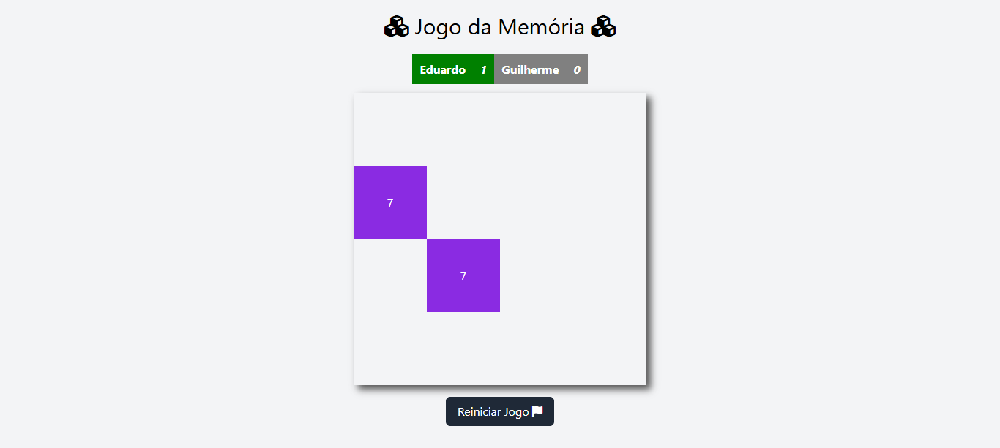

# 🧠 **Jogo da Memória**

Este é um projeto de **Jogo da Memória** desenvolvido em HTML, CSS, e JavaScript. Ele permite que dois jogadores se enfrentem, testando suas habilidades de memória enquanto competem por pontos.

## 📋 **Funcionalidades**

- **Modo "Multiplayer"**: Dois jogadores se revezam para encontrar pares.
- **Tabuleiro Dinâmico**: Os pares são embaralhados a cada jogo.
- **Pontuação em Tempo Real**: O placar de cada jogador é atualizado após cada jogada.
- **Reiniciar Jogo**: Opção de reinício com tabuleiro limpo.
- **Personalização de Nomes**: Jogadores podem editar seus nomes antes da primeira jogada.
- **Design Responsivo**: Interface adaptada para diversos tamanhos de tela, com suporte a TailwindCSS.

## 🚀 **Como Jogar**

1. **Escolha os Jogadores**:
   - Antes de começar, edite os nomes clicando no ícone de lápis ao lado dos jogadores.
   - Após o início do jogo (primeiro clique), os nomes não poderão ser alterados.

2. **Faça uma Jogada**:
   - Clique em dois botões do tabuleiro para tentar encontrar pares correspondentes.
   - Se acertar, os botões permanecem desativados e você ganha pontos.
   - Caso erre, o turno passa para o próximo jogador.

3. **Vença o Jogo**:
   - O jogo termina quando todos os pares forem encontrados.
   - O jogador com mais pontos será declarado vencedor.
   - Em caso de empate, será exibida uma mensagem indicando igualdade.

4. **Reinicie o Jogo**:
   - Clique no botão "Reiniciar Jogo" para começar uma nova partida.

## 🛠️ Tecnologias Utilizadas

- **HTML**: Estrutura básica do jogo.
- **CSS/TailwindCSS**: Estilização e design responsivo.
- **JavaScript**: Lógica do jogo, manipulação de eventos e DOM.
- **Font Awesome**: Ícones para a interface.
- **Favicon**: Ícones personalizados para o navegador.

## 🖼️ Prévia



## 📦 Como Executar o Projeto

### 1. Clone o repositório:

```bash
git clone https://github.com/eduardomarcolin09/Jogo_Da_Memoria.git
```

### 2. Acesse a pasta do projeto:

```bash
cd Jogo_Da_Memoria
```

### 3. Abra o arquivo index.html em um navegador.

## 📝 **Melhorias Futuras**

- Adicionar níveis de dificuldade com diferentes tamanhos de tabuleiro.
- Implementar cronômetro para jogadas com limite de tempo.
- Permitir o modo para mais de dois jogadores.

## 📚 **Notas Finais**

- Este projeto foi desenvolvido como uma prática de programação e é aberto a sugestões e melhorias.
- Caso encontre algum bug ou comportamento inesperado, sinta-se à vontade para abrir uma issue no repositório.
- O Jogo da Memória foi projetado para ser simples e divertido, com foco no aprendizado de manipulação de DOM e lógica em JavaScript.
- **Divirta-se jogando e explorando o código! 😊**